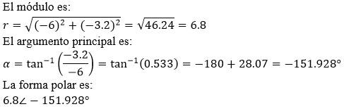

# PRÁCTICA No. 9 Fasores

#### Integrantes:

CALDERON VIDAL MATEO ESTEBAN

CAMACHO SIZA JOSUE EVERETT

GUEVARA CARVAJAL LUIS EDUARDO

#### NRC:

5406

## Objetivos

***Objetivo General***

- Comprender  los distintos usos de operaciones aritméticas con números complejos, sea de su forma polar o de su forma polar.

***Objetivos específicos***

- Comprobar la efectividad del uso de la Calculadora Científica en el análisis de ejercicios de números complejos.

- Comprender la representación de los números complejos sea gráficamente y matemáticamente.

- Entender el uso de los números complejos en el estudio de fasores y aplicando al análisis de circuitos en ca.

## Marco teórico

## Explicación del procedimiento

***Material y equipo requerido***

*Tabla I. Materiales y Equipo*

***Pasos a seguir***

1. Resolver los distintos ejercicios de números complejos en una hoja.

2. Traspasar los ejercicios a un procesador de textos.

3. Analice lo que ocurre al usar la calculadora y de la otra forma.

***Procedimiento***

**Resolver los siguientes ejercicios:**

*1. Transforme a su forma polar:*

*a. 2+3j*

*b. -8+6.2j*

*c. 4.3-2.8j*

*d. -6-3.2j*

*2. Transforme a su forma rectangular:*

*a. 36∠-10°*

*b. 28.7∠135°*

*c.11.2∠28°*

*d. 45∠-117.9°*

*3. Realice las siguientes operaciones paso a paso, y represente el resultado tanto en su forma rectangular como en su forma polar.*

*a. (10+3j/2j)-(7+2j)(3∠-115°)*

*b. 6.8∠125.3°+(4.5∠-11.5°)/(7.6-1.2j)*

*c. (34+28.5j)/(4∠-20.8°)-51.2∠-215°*

*4. Resuelva las operaciones anteriores por medio de la calculadora y compare resultados.*

**EJERCICIO 1**

*1. Transforme a su forma polar:*

*a. 2+3j*

*b. -8+6.2j*

*c. 4.3-2.8j*

*d. -6-3.2j*

## Resultados

***% Error relativo porcentual***

**EJERCICIO 1**

- Literal A

- Literal B

- Literal C

- Literal D

## Video

## Conclusiones

## Bibliografía 

